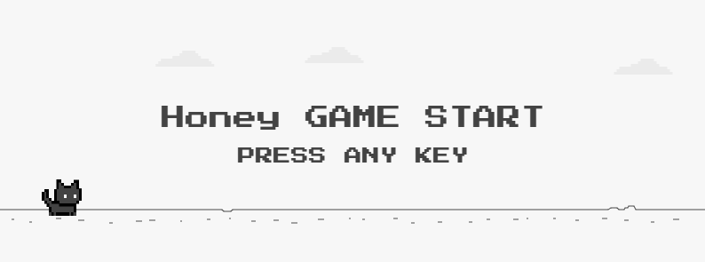

게임을 좋아하는 저는 개발자가 되었을 때부터 **꼭 한번 게임을 개발** 해보고 싶다는 뜨거운 생각을 가지고 있었습니다.
하지만 바쁜 일상을 핑계로 계속 미루다가, 어느 날 갑자기 결심하게 되었습니다! **"일단 해보자!"** 💪

처음에는 제가 정말 게임 개발을 할 수 있을까 하는 걱정이 앞섰습니다.
게임을 만들고 싶어 했지만 어떤 게임을 만들어야 하고 그 게임을 어떤 언어로 개발해야 할지 많은 고민이 들었어요.🤔

하지만 막상 시작해보니 생각보다 재미있고 수월하게 진행되었습니다! 
물론 많은 시행착오가 있었습니다. 캔버스 API를 활용한 애니메이션 처리, 웹소켓을 통한 실시간 통신, 게임 성능 최적화 등 여러 기술적 도전이 있었죠.

하지만 이런 문제들을 하나씩 해결해 나가면서 많은 것을 배우고 성장할 수 있었습니다. 
이 과정을 통해 저는 **"생각만 하기보다는 행동으로 옮기는 것이 중요하다"** 는 값진 교훈을 얻었습니다. 
아이디어를 행동으로 옮기는 그 순간, 비로소 진정한 성장이 시작된다는 것을 깨달았습니다.🌟

이 블로그 글을 통해 제가 개발한 Cat Run 게임의 프론트엔드와 백엔드 구현 과정, 그리고 그 과정에서 배운 기술적 포인트들을 공유하고자 합니다.

## 📌 프로젝트 소개



**Cat Run**은 귀여운 픽셀 아트 스타일의 고양이 달리기 게임입니다. 장애물을 피해 최대한 멀리 달리는 것이 목표인 **무한 러닝 게임**이에요!🐱
크롬의 공룡게임인 다이노를 모티브로 하여 게임을 개발했으며 웹소켓 통신을 활용한 실시간 랭킹 시스템을 구현하여 경쟁 요소를 추가했습니다.
또한 라이트/다크 모드가 전환되는 시각적 효과를 더했습니다!

## 🛠️ 사용 기술

### 프론트엔드
- **TypeScript** - 타입 안전성 확보
- **HTML5 Canvas API** - 게임 그래픽 구현
- **SCSS** - 스타일링
- **Socket.IO Client** - 웹소켓 실시간 통신
- **Vite** - 빌드 및 개발 환경

### 백엔드
- **Node.js + TypeScript**
- **NestJS 11** - 모듈 기반 서버 프레임워크
- **Prisma ORM** - 타입 안전한 DB 접근
- **Socket.IO (NestJS Gateway)** - 실시간 양방향 통신
- **class-validator** - 선언적 DTO 검증
- **ioredis** - Redis 클라이언트 (랭킹 캐싱 / mTLS 지원)
- **MySQL** - 주요 데이터 저장소

## ✨ 주요 기능

### 🎮 게임 메커니즘

Cat Run의 핵심은 간단하면서도 중독성 있는 게임입니다! 🐾 🎮
플레이어는 귀여운 픽셀 아트 고양이 캐릭터를 조작하여 끝없이 펼쳐지는 세상을 달려나갑니다. 🏃‍♂️
조작법은 스페이스바나 위쪽 화살표 키를 누르거나 게임 영역을 클릭하면 고양이가 점프하며 장애물을 뛰어넘어요!

게임이 진행될수록 다양한 형태의 장애물들이 등장하여 긴장감을 더해줍니다. 
생존 시간이 길어질수록 점수 및 게임 속도가 계속 증가하여 더욱 스릴 넘치는 경험을 선사합니다! 
게임 도중에 특정 구간에 도달하면 라이트 모드에서 다크 모드로 자연스럽게 전환되는 시각적 변화를 경험할 수 있습니다. 🌅🌙

### 📊 실시간 랭킹 시스템

혼자 플레이하는 게임도 재미있지만, 다른 플레이어들과 함께 경쟁할 때 진짜 재미가 시작됩니다! 💪 
Cat Run은 WebSocket 기술을 활용한 실시간 랭킹 시스템을 구현하여 전 세계 플레이어들과 순위를 경쟁할 수 있도록 했습니다.

전체 랭킹에서는 모든 플레이어들 중 상위 5명의 점수들을 실시간으로 확인할 수 있어요! 🏆 
동시에 개인 랭킹 시스템을 통해 자신만의 베스트 스코어 5개를 실시간으로 확인하여 개인 기록 갱신의 즐거움도 느낄 수 있습니다. 
게임을 플레이하는 동안 랭킹 정보가 실시간으로 업데이트되어, 새로운 기록이 달성되거나 순위가 변동될 때마다 즉시 반영됩니다! ⚡

성능 최적화를 위해 자주 조회되는 랭킹 데이터는 Redis를 활용하여 캐싱했기 때문에, 빠른 응답 속도로 끊김 없는 게임 경험을 제공합니다. 📈

### 🎨 시각적 요소

Cat Run의 매력적인 비주얼은 게임의 핵심 요소 중 하나입니다! 
전체 게임은 레트로한 픽셀 아트 스타일로 디자인되어 마치 90년대 고전 게임을 플레이하는 듯한 향수를 불러일으킵니다.
이러한 픽셀 아트는 단순해 보이지만 세심한 디테일이 담겨 있어 시각적 만족감을 제공합니다.

고양이 캐릭터의 애니메이션은 특히 볼거리입니다! 왜냐하면 고양이가 굉장히 귀엽거든요. 🐱
캔버스 API를 통해 선 하나하나를 이어 그린 고양이 캐릭터이기에 깊은 애정이 생겼어요. ~~집에서 키우고 있는 반려묘보다 더 애정이 들어요~~
달리기, 점프, 착지 등 모든 동작을 구현했고, requestAnimationFrame을 활용한 애니메이션으로 자연스러운 움직임을 표현했습니다.

무엇보다 특별한 것은 색상 전환 시스템입니다! 🌈 
게임이 진행되면서 특정 점수에 도달하면 화면의 색상 테마가 부드럽게 변화하는데, 이는 단순한 색상 변경이 아닌 정교한 색상 보간 기법을 통해 
자연스럽고 아름다운 그라데이션 효과를 만들어냅니다. 밝은 낮에서 신비로운 밤으로 변해가는 과정을 지켜보는 것만으로도 충분히 매혹적이에요! ✨
저는 특히 다크 모드가 정말 매혹적이라고 생각해요.🌙

## 💻 프론트엔드 기술적 포인트

### Canvas API를 활용한 게임 엔진 구현

게임의 핵심은 HTML5 Canvas API를 활용한 자체 게임 엔진입니다. 모든 게임 요소는 Canvas에 그려지며, requestAnimationFrame을 사용해 프레임마다 업데이트됩니다.

```typescript
private update(): void {
  const currentTime = Date.now();
  
  if (this.isGameOver) return this.drawGameOver();
  if (this.changeColor) this.updateColor(currentTime);
  
  // 화면 지우기
  this.ctx.fillStyle = this.color.black100;
  this.ctx.fillRect(0, 0, this.width, this.height);
  
  // 게임 요소 업데이트 및 그리기
  this.sky.update(currentTime);
  this.sky.draw(this.ctx);
  this.floor.update(currentTime);
  this.floor.draw(this.ctx);
  this.cat.update(currentTime);
  this.cat.draw(this.ctx);
  
  // 게임 로직 처리
  if (this.isGameStart) {
    this.obstacle.update(currentTime);
    this.obstacle.draw(this.ctx);
    this.updateGameState(currentTime);
    this.checkGameOver();
  }
  
  // 랭킹 그리기
  this.ranking.draw(this.ctx);
  
  requestAnimationFrame(() => this.update());
}
```

### 고양이 캐릭터 직접 그리기

가장 정성스럽게 만든 부분 중 하나는 바로 고양이 캐릭터입니다! 🐱 
외부 이미지 파일을 사용하지 않고 **Canvas API의 선과 도형만으로** 픽셀 하나하나 직접 그려서 만들었어요.

```typescript
export function drawCat(ctx: CanvasRenderingContext2D, x: number, y: number, color: T.CatColor): void {
  ctx.save();
  ctx.translate(x, y);
  ctx.scale(C.SCALE, C.SCALE);
  
  // 고양이 몸통 외곽선을 Path2D로 정교하게 그리기
  ctx.fillStyle = color.body;
  ctx.beginPath();
  
  // 귀부터 시작해서 시계방향으로 외곽선 그리기 (30여개의 좌표점)
  ctx.moveTo(18, -13);  // 왼쪽 귀 끝
  ctx.lineTo(18, -3);   // 귀에서 머리 측면
  ctx.lineTo(15, -3);   // 머리 위쪽
  ctx.lineTo(15, 11);   // 목 부분
  ctx.lineTo(12, 11);   // 가슴
  ctx.lineTo(12, 26);   // 앞다리
  ctx.lineTo(28, 26);   // 배
  ctx.lineTo(28, 23);   // 뒷다리 시작
  ctx.lineTo(40, 23);   // 뒷다리
  ctx.lineTo(40, 26);   // 뒷발
  ctx.lineTo(56, 26);   // 꼬리 시작
  ctx.lineTo(56, 8);    // 꼬리 끝
  ctx.lineTo(53, 8);    // 꼬리 안쪽
  ctx.lineTo(53, -3);   // 등
  ctx.lineTo(50, -3);   // 머리 뒤
  ctx.lineTo(50, -13);  // 오른쪽 귀
  ctx.lineTo(18, -13);  // 시작점으로 돌아와서 닫기
  
  ctx.fill(); // 몸통 채우기

  // 눈 그리기 (정확한 픽셀 위치로 표정 만들기)
  ctx.fillStyle = color.eye;
  ctx.fillRect(24, 3, 3, 4);  // 왼쪽 눈
  ctx.fillRect(35, 3, 3, 4);  // 오른쪽 눈
  
  // 얼굴과 몸의 디테일 선 그리기 (각 부위별 정밀한 선 표현)
  ctx.fillStyle = color.line;
  ctx.fillRect(21, -3, 1, 11);   // 왼쪽 얼굴선
  ctx.fillRect(28, 8, 1, 15);    // 앞다리 구분선
  ctx.fillRect(40, 8, 1, 15);    // 뒷다리 구분선
  ctx.fillRect(46, -3, 1, 11);   // 오른쪽 얼굴선
  
  ctx.restore();
}
```

모든 그래픽 요소를 이런 식으로 **좌표 하나하나 계산해서** 그렸기 때문에 정말 애정이 많이 들어간 게임이에요! ✨

디테일한 부분을 말하자면 끝이 없지만 특히 다크모드에서 나타나는 달은 **세 가지 모양**으로 변화합니다!
처음엔 오른쪽 초승달로 시작해서 → 보름달 → 왼쪽 초승달 순서로 바뀌어요.
이런 작은 디테일들이 게임에 생동감과 퀄리티를 더해주는 것 같아요! 😊

### 다크모드 전환 애니메이션

게임 진행 중 특정 점수에 도달하면 **700ms 동안** 부드럽게 밝은 낮에서 어두운 밤으로 전환되는 시스템을 구현했습니다! 🌅🌙

```typescript
private updateColor(currentTime: number): void {
  if (!this.transitionStartTime) {
    this.transitionStartTime = currentTime;
  }

  const elapsed = currentTime - this.transitionStartTime;
  const progress = Math.min(elapsed / 700, 1);  // 0~1 진행률 계산
  
  // 시작 색상과 목표 색상 정의
  const startColor = this.mode === 'light' ? COLOR.light : COLOR.dark;
  const endColor = this.mode === 'light' ? COLOR.dark : COLOR.light;

  // 모든 게임 요소의 색상을 점진적으로 변경
  (Object.keys(this.color) as Array<keyof T.Color>).forEach((key) => {
    this.color[key] = colorTransition(startColor[key], endColor[key], progress);
  });

  // 전환 완료 시 모드 변경
  if (progress === 1) {
    this.changeColor = false;
    this.mode = this.mode === 'light' ? 'dark' : 'light';
    this.sky.mode = this.mode;
  }
}

// RGB 색상 보간 함수
function colorTransition(start: string, end: string, progress: number): string {
  const startRgb = hexToRgb(start);
  const endRgb = hexToRgb(end);
  
  const r = Math.round(startRgb.r + (endRgb.r - startRgb.r) * progress);
  const g = Math.round(startRgb.g + (endRgb.g - startRgb.g) * progress);
  const b = Math.round(startRgb.b + (endRgb.b - startRgb.b) * progress);
  
  return `rgb(${r}, ${g}, ${b})`;
}
```

### WebSocket 실시간 양방향 통신 구현

정말 많은 고민과 시행착오를 거쳐 완성한 실시간 랭킹 시스템입니다! 💫

**Socket.IO 로 안정적인 연결**

```typescript
import { io, Socket } from 'socket.io-client';

export class WebSocketClient {
  private socket: Socket;

  constructor() {
    this.socket = io(import.meta.env.VITE_API_URL, {
      reconnection: true,            // 끊어지면 자동 재연결
      reconnectionDelay: 5000,       // 5초 간격으로 재시도
      reconnectionAttempts: Infinity,
      withCredentials: true,         // 서버 CORS credentials 와 짝 맞춤
    });
  }

  connect(callback: (data: T.WSCatData) => void) {
    // 연결 직후 초기 데이터 요청 (빈 페이로드 → 서버가 IP 로 분기)
    this.socket.on('connect', () => {
      this.sendMessage({});
    });

    // 단일 'cat' 채널만 구독 — 개인/전체 분기는 서버가 결정
    this.socket.on('cat', (data: T.WSCatData) => {
      callback(data);
    });
  }

  sendMessage(payload: Record<string, unknown>) {
    if (this.socket.connected) {
      // 서버의 @SubscribeMessage('cat') 핸들러로 전달
      this.socket.emit('cat', payload);
    }
  }
}
```

NestJS Gateway 로 백엔드를 옮기면서 가장 좋았던 건, **클라이언트가 채널을 두 개 구독할 필요가 없어졌다는 점**이에요! 🎉
STOMP 시절엔 `/topic/...` 과 `/queue/...` 를 따로 구독했지만, Socket.IO 에서는 서버가 `client.emit` / `server.emit` 으로 송신 대상을 결정하기 때문에 **프론트엔드 구독 코드가 절반으로** 줄어들었습니다.

**게임 엔진에서의 WebSocket 활용**

게임 엔진에서는 WebSocket을 통해 받은 데이터를 실시간으로 게임에 반영합니다! 🎮

```typescript
export class Engine {
  private wsClient!: WebSocketClient;
  private catInfo!: T.CatData;
  private allRankings!: T.RankData;
  private myRankings!: T.RankData;

  constructor(canvasId: string) {
    // WebSocket 연결 및 메시지 처리
    this.wsClient = new WebSocketClient();
    this.wsClient.connect((data) => {
      switch (data.code) {
        case "NOT_CAT":
          // 고양이가 없는 경우 - 전체 랭킹만 받음
          this.allRankings = data.top5GamePlayHistory;
          this.start();
          break;
          
        case "CREATE_CAT":
          // 고양이 생성 성공 시 세션에 고양이 정보 저장
          this.catInfo = data.cat;
          break;
          
        case "ALL_DATA":
          // 기존 고양이가 있는 경우 - 모든 데이터 받음
          this.catInfo = data.cat;
          this.allRankings = data.top5GamePlayHistory;
          this.myRankings = data.byCatTop5GamePlayHistory;
          this.start();
          break;
          
        case "UPDATE_ALL_RANK":
          // 실시간 전체 랭킹 업데이트 (모든 사용자에게 브로드캐스트)
          this.allRankings = data.top5GamePlayHistory;
          this.ranking.updateAllRankings(this.ctx, this.allRankings);
          break;
          
        case "UPDATE_MY_RANK":
          // 개인 랭킹 업데이트 (개인 세션에만 전송)
          this.myRankings = data.byCatTop5GamePlayHistory;
          this.ranking.updateMyRankings(this.ctx, this.myRankings);
          break;
      }
    });
  }

  // 게임 오버 시 점수 전송
  private async sendGameScore(): Promise<void> {
    this.wsClient.sendMessage({
      catNo: this.catInfo.no,
      score: this.score
    });
  }
}
```

**개인 메시지 vs 전체 메시지**

WebSocket 통신에서 가장 중요했던 부분은 **메시지를 누구에게 보낼지 결정하는 것**이었어요!

**전체 브로드캐스트 (`server.emit('cat', ...)`)**  
- 전체 랭킹이 변경되었을 때 → **모든 접속자에게 동시에 전송** 📢
- 새로운 최고 점수가 나왔을 때 모든 플레이어가 실시간으로 확인 가능

<br>

**개인 전용 메시지 (`client.emit('cat', ...)`)**  
- 개인 랭킹이 업데이트되었을 때 → **해당 세션의 사용자에게만 전송** 🔒
- 각자의 개인 기록은 본인만 실시간으로 업데이트 받음
- 소켓 인스턴스 자체가 세션 식별자 역할

<br>

이렇게 구분해서 구현함으로써 **불필요한 네트워크 트래픽을 줄이고** 각 사용자에게 **정말 필요한 정보만** 전달할 수 있었습니다! ⚡

**핵심 포인트**: NestJS Gateway 안에서 `@WebSocketServer()` 로 주입받은 `Server` 인스턴스의 `server.emit` 은 전체 브로드캐스트, `@ConnectedSocket()` 으로 받은 개별 소켓의 `client.emit` 은 1:1 송신으로 자연스럽게 분기됩니다.
프론트엔드에서는 단일 `'cat'` 이벤트만 구독하면 되기 때문에, **송신 대상 결정 책임이 온전히 서버에 있다는 게 굉장히 깔끔**합니다! 💪

## 💾 백엔드 기술적 포인트

> 💡 사실 이 백엔드는 처음엔 **Spring Boot 3.4.4 (Java 21)** 로 만들었다가 NestJS 11 + Prisma + Socket.IO 로 전면 전환한 거예요.
> 왜 옮겼는지, 옮기고 나니 뭐가 달라졌는지는 [Cat Run 백엔드, Spring Boot에서 NestJS로 갈아타다](/12-cat-run-migration) 글에 따로 정리해뒀습니다. 🔄

### 모듈 기반 아키텍처

NestJS의 가장 큰 매력은 **도메인 단위로 모듈을 쪼갤 수 있다는 점**이에요! 🧩
Cat Run 백엔드는 `CatModule`, `GamePlayHistoryModule`, `GameModule`, `RedisModule`, `PrismaModule` 다섯 개로 모듈을 나누고,
실시간 통신을 담당하는 `GameModule` 이 두 도메인 서비스를 주입받아 **오케스트레이션 역할만** 수행하도록 책임을 분리했습니다.

```typescript
@Module({
  imports: [
    ConfigModule.forRoot({ isGlobal: true }),
    PrismaModule,
    RedisModule,
    CatModule,
    GamePlayHistoryModule,
    GameModule,
  ],
})
export class AppModule {}
```

이렇게 모듈을 나누니 **각 도메인의 비즈니스 로직과 통신 계층이 깨끗하게 분리**되어, 테스트할 때도 필요한 모듈만 골라 띄울 수 있고 책임 경계가 흐트러지지 않더라고요! ✨

### NestJS Gateway 로 구현한 WebSocket

Spring 의 `@MessageMapping` 과 가장 비슷한 게 NestJS의 **`@SubscribeMessage` 데코레이터**에요!
`WebSocketGateway` 클래스 하나로 **연결 / 해제 라이프사이클 + 메시지 처리** 까지 한 번에 묶을 수 있어 정말 깔끔했습니다.

```typescript
@WebSocketGateway({
  cors: {
    origin: (origin, callback) => {
      const allowed = getAllowedOrigins();
      if (!origin || allowed.includes(origin)) return callback(null, true);
      return callback(null, false);
    },
    credentials: true,
  },
})
export class GameGateway implements OnGatewayConnection, OnGatewayDisconnect {
  @WebSocketServer()
  server!: Server;

  constructor(
    private readonly catService: CatService,
    private readonly redisService: RedisService,
    private readonly gamePlayHistoryService: GamePlayHistoryService,
  ) {}

  handleConnection(client: GameSocket): void {
    // 프록시 환경(X-Forwarded-For) 까지 고려해 클라이언트 IP 추출
    client.clientIp = getClientIp(client);
  }

  @SubscribeMessage('cat')
  async handleCatMessage(
    @ConnectedSocket() client: GameSocket,
    @MessageBody() payload: CatChannelPayload,
  ): Promise<void> {
    const ip = client.clientIp;

    if (payload.catName) return this.createCat(client, payload.catName, ip);
    if (payload.catNo != null && payload.score != null) {
      return this.addGameScore(client, payload.catNo, payload.score);
    }
    return this.prepareInitialData(client, ip);
  }
}
```

핵심 포인트는 **단일 `'cat'` 채널** 위에서 페이로드 형태로 분기한다는 것입니다! 🎯  
`catName` 만 있으면 고양이 생성, `catNo + score` 면 점수 제출, 빈 페이로드면 초기 데이터 요청처럼요. 채널을 여러 개 만들기보다 **페이로드 의도로 분기**하는 쪽이 클라이언트와 서버 모두에서 단순했습니다.

### Prisma 의 조건부 Atomic Update — Race Condition 방어

게임 점수는 동시에 여러 세션에서 들어올 수 있기 때문에, **최고 점수 갱신을 read → compare → write 패턴으로 짜면 안 돼요!** ⚠️
이 사이에 다른 세션이 더 높은 점수를 먼저 써넣으면, 내 갱신이 그걸 덮어쓰는 **lost update** 가 발생하기 때문입니다.

해결책은 **Prisma 의 `where` 에 비교 조건을 직접 넣어 SQL 한 방으로 atomic update** 하는 것이었어요.

```typescript
async updateHighestScore(catNo: number, score: number) {
  try {
    const cat = await this.prisma.cat.update({
      // ✅ 현재 highestScore 가 새 score 보다 작은 경우에만 갱신
      where: { no: catNo, highestScore: { lt: score } },
      data: { highestScore: score, highestScoreAt: new Date() },
    });
    return { updated: true, cat };
  } catch (error) {
    if ((error as { code?: string }).code === 'P2025') {
      // 갱신 대상이 없음 = 이미 더 높은 점수가 존재 → 기존 값 반환
      const existing = await this.prisma.cat.findUnique({ where: { no: catNo } });
      if (!existing) throw new NotFoundCatException(`Cat not found: ${catNo}`);
      return { updated: false, cat: existing };
    }
    throw error;
  }
}
```

`P2025` 는 Prisma 가 "조건에 맞는 row 가 없어 update 대상 0건" 일 때 던지는 에러입니다.
이걸 **"최고 점수가 갱신되지 않았다" 시그널** 로 활용해서, 분산 락이나 별도 트랜잭션 없이 **DB 자체를 single source of truth** 로 두고 race 를 막을 수 있었어요! 🔒

### setIfChanged 로 불필요한 브로드캐스트 차단

전체 랭킹은 모든 접속자에게 브로드캐스트되기 때문에, **변동이 없을 때 굳이 메시지를 뿌리는 건 트래픽 낭비**입니다.
그래서 Redis 캐시의 직전 값과 비교해서 **실제로 바뀐 경우에만 set + emit** 하는 패턴을 만들었어요.

```typescript
private async setIfChanged<T>(key: string, value: T): Promise<boolean> {
  const newJson = JSON.stringify(value);
  const cachedJson = await this.redisService.get(key);

  if (newJson !== cachedJson) {
    await this.redisService.set(key, newJson);
    return true;        // 변동 발생 → 호출부가 emit
  }
  return false;          // 변동 없음 → emit 생략
}

private async addGameScore(client: GameSocket, catNo: number, score: number) {
  await this.gamePlayHistoryService.createGamePlayHistory({ catNo, score });
  const { updated: highestUpdated } = await this.catService.updateHighestScore(catNo, score);

  // 1) 개인 랭킹 — 변동 시에만 해당 세션에 emit
  const updatedCatTop5 = await this.gamePlayHistoryService.getByCatTop5GamePlayHistory(catNo);
  if (await this.setIfChanged(redisKeyTop5ByCat(catNo), updatedCatTop5)) {
    client.emit('cat', { code: WS_CODE.UPDATE_MY_RANK, top5ByCat: updatedCatTop5 });
  }

  // 2) 전체 랭킹 — 최고 점수 갱신 + 캐시값 변경 모두 만족할 때만 broadcast
  if (!highestUpdated) return;
  const updatedTop5Cats = await this.catService.getTop5Cats();
  if (await this.setIfChanged(REDIS_KEY_TOP5_CATS, updatedTop5Cats)) {
    this.server.emit('cat', { code: WS_CODE.UPDATE_ALL_RANK, top5Cats: updatedTop5Cats });
  }
}
```

이중 가드 (`highestUpdated` + `setIfChanged`) 를 두니 **DB 갱신 → 캐시 비교 → emit** 흐름이 자연스럽게 일관되더라고요!
이 구조에서 캐시는 단순한 성능 최적화를 넘어 **"변경 감지기"** 역할까지 해주는 셈이라, 네트워크 트래픽을 꽤 많이 절약할 수 있었습니다. ⚡

### class-validator 로 선언적 DTO 검증

Spring 의 `@Valid` + Bean Validation 과 똑같은 역할을, NestJS 에서는 **`class-validator` 데코레이터**로 처리합니다.
DTO 클래스에 검증 룰을 적어두면 `ValidationPipe` 가 모든 진입점에서 자동으로 검사해줘요.

```typescript
export class CreateCatDto {
  @IsString()
  @IsNotEmpty({ message: 'Cat name is required' })
  @MaxLength(CAT_NAME_MAX_LENGTH, {
    message: `Cat name must be at most ${CAT_NAME_MAX_LENGTH} chars`,
  })
  name!: string;
}

// main.ts — 전역 ValidationPipe 등록
app.useGlobalPipes(
  new ValidationPipe({
    whitelist: true,            // DTO 에 없는 필드는 자동 제거
    forbidNonWhitelisted: true, // 정의되지 않은 필드 들어오면 400
    transform: true,            // 평문 객체 → DTO 인스턴스로 변환
  }),
);
```

`whitelist: true` 옵션 덕분에 **요청 본문에 정의되지 않은 키가 섞여 들어오는 것을 1차로 차단**할 수 있어, 컨트롤러 / 서비스 코드 안에서 방어 로직을 쓸 일이 거의 없어졌어요. 🛡️

### 전역 예외 필터로 일관된 에러 응답

도메인 예외를 클래스로 표현하고, **응답 포맷을 한 곳에서 결정**하기 위해 `BaseException` + `GlobalExceptionFilter` 를 두었습니다.

```typescript
export class BaseException extends HttpException {
  constructor(
    public readonly errorCode: string,
    message: string,
    statusCode: HttpStatus,
  ) {
    super({ errorCode, message }, statusCode);
  }
}

@Catch()
export class GlobalExceptionFilter implements ExceptionFilter {
  catch(exception: unknown, host: ArgumentsHost): void {
    const response = host.switchToHttp().getResponse<Response>();

    if (exception instanceof BaseException) {
      response.status(exception.getStatus()).json({
        code: exception.getStatus(),
        message: exception.message,
        errorCode: exception.errorCode,
        data: null,
      });
      return;
    }
    // 그 외 예외는 500 으로 일괄 변환...
  }
}
```

서비스 레이어에서는 `throw new NotFoundCatException(...)` 같이 **의미 있는 도메인 예외만 던지면** 되고, 응답 포맷은 필터가 책임지기 때문에 **로직과 응답 표현이 완전히 분리**됩니다.
한 번 깔아두면 새 도메인을 추가할 때마다 같은 패턴을 그대로 따라갈 수 있어 일관성 유지가 정말 편해요! ✨

### Prisma 스키마로 인덱스까지 관리

Prisma 의 매력 중 하나는 **DB 스키마와 인덱스를 코드로 형상관리**할 수 있다는 점입니다.
랭킹 조회 패턴(`catNo` 로 필터 + `score` 내림차순)에 맞춰 복합 인덱스를 미리 걸어두었어요.

```prisma
model GamePlayHistory {
  no       Int      @id @default(autoincrement())
  catNo    Int      @map("cat_no")
  score    Int
  createAt DateTime @default(now()) @map("create_at")

  cat Cat @relation(fields: [catNo], references: [no])

  // 개인 랭킹 조회 — (catNo ASC, score DESC) 복합 인덱스로 정렬 비용 제거
  @@index([catNo, score(sort: Desc)], map: "idx_history_cat_score")
  @@map("game_play_history")
}
```

운영 DB 와 컬럼명은 `@map` 으로 snake_case 매핑하고, **인덱스 정의까지 스키마 파일에 함께 담아두면** `prisma migrate` 가 알아서 SQL 을 생성해줍니다.
DB 와 코드 사이의 lag 가 사라져서 정말 마음에 들었어요! 💚

## 🔧 개발 과정에서의 도전과 해결책

### 성능 최적화

게임 개발 과정에서 가장 까다로웠던 부분은 바로 성능 최적화였습니다! 🚀 
처음에는 Canvas에 많은 요소들을 동시에 그리다 보니 프레임이 뚝뚝 끊어지는 현상이 발생했어요. 

첫 번째로 적용한 해결책은 **화면 밖의 요소는 그리지 않는 방식의 렌더링 최적화**였습니다. 💡 
사용자가 보지 못하는 영역의 요소들까지 계속 렌더링하는 것은 완전한 자원 낭비였거든요! 
이를 위해 화면에 보이는 요소들만 선별적으로 그리도록 구현했습니다.

마지막으로 **객체 풀링을 통한 메모리 최적화**를 도입했습니다. 🔄 
게임이 진행되면서 장애물들이 계속 생성되고 소멸되는 과정에서 가비지 컬렉션이 자주 발생하여 프레임 드롭이 일어났어요. 
이를 해결하기 위해 미리 생성된 객체들을 재활용하는 풀링 시스템을 구축하여 메모리 할당과 해제로 인한 성능 저하를 크게 줄일 수 있었습니다! 
결과적으로 이러한 최적화 기법들 덕분에 매끄럽고 안정적인 60fps 게임 경험을 제공할 수 있게 되었습니다.

### 데이터 일관성 유지

랭킹 데이터를 Redis 에 캐싱하면서 **MySQL 원본 데이터와의 일관성 유지**가 중요한 과제였어요.
처음에는 Redis 트랜잭션(`MULTI` / `WATCH`)으로 직접 정합성을 챙기려 했는데, 동시 갱신 시나리오가 늘어날수록 트랜잭션 충돌 처리 코드가 굉장히 복잡해지더라고요. 😵

그래서 **DB 를 single source of truth 로 두는 한 방향 흐름**으로 단순화했습니다.

1. **Prisma 의 조건부 atomic update** 로 race 를 DB 단에서 차단 (`where: { highestScore: { lt: score } }`)
2. 갱신 후엔 **DB 결과로부터 랭킹을 다시 계산** 해서 신뢰 가능한 값을 만들고
3. **`setIfChanged`** 로 캐시와 비교해서 변동이 있을 때만 Redis 업데이트 + emit

이렇게 흐름을 잡으니 분산 락이나 Redis 트랜잭션 같은 복잡한 메커니즘 없이도 **"DB → 캐시" 한 방향 동기화**만 보장하면 되어, 구현이 훨씬 단순해지고 디버깅도 편해졌어요!
**복잡한 동시성 제어는 DB 가 가장 잘하는 일에 위임한다** — 이번 프로젝트에서 얻은 가장 값진 교훈 중 하나였습니다! 🎯

## 🎬 마무리

처음으로 진행한 게임 개발 프로젝트였지만, 많은 기술적 도전과 문제 해결 과정을 통해 값진 경험을 얻을 수 있었습니다. 
Canvas API와 WebSocket을 활용한 실시간 게임 개발은 제가 생각했던 것보다 훨씬 재미있고 보람찬 경험이었습니다!

이 프로젝트를 통해 저는 "시작이 반이다"라는 말의 의미를 다시 한번 깨달았습니다. 망설이고 걱정하는 대신 일단 시작해보니, 
생각보다 잘 풀리고 많은 것을 배울 수 있었죠. 특히 컴포넌트 기반 설계와 최적화 기법을 적용하는 과정이 매우 유익했습니다.

하단에 Cat Run 게임을 플레이할 수 있는 URL을 남겨 놓겠습니다! 재미있게 플레이 해보시고 피드백은 언제든지 환영합니다! 🙏

[Cat Run 게임 플레이하기](https://cat-run.seunghoney.com)
```toc
``` 
